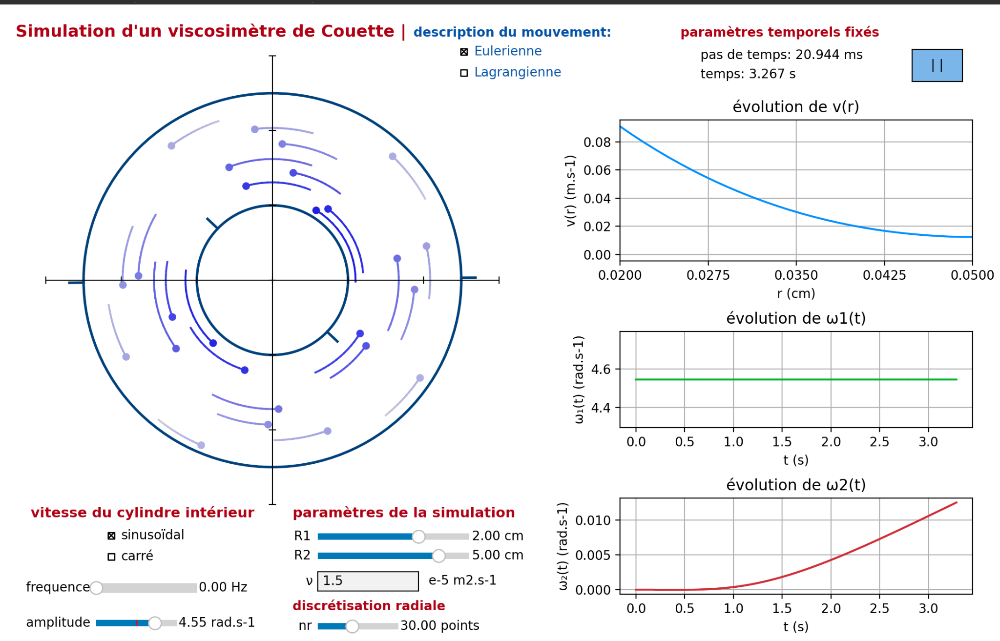

# Couette Viscometer — Physical Simulation

> Interactive numerical simulation of viscous fluid flow between two coaxial rotating cylinders, built from scratch in Python during a one-week coding sprint at CentraleSupélec.



---

## Overview

A **Couette viscometer** measures fluid viscosity by confining a fluid between an inner and an outer cylinder. When the inner cylinder rotates, viscous drag progressively sets the outer one in motion. The rate of this transfer encodes the kinematic viscosity ν.

This project simulates that physical process in real time. It solves the governing PDE numerically at each time step and renders the result as an interactive Matplotlib application with live plots and animated fluid particles.

---

## Physics

The tangential velocity field v_θ(r, t) satisfies the following diffusion-type PDE in cylindrical coordinates:

```
∂v_θ/∂t = ν ( ∂²v_θ/∂r² + (1/r) ∂v_θ/∂r − v_θ/r² )
```

**Boundary conditions**
- Inner wall (r = R₁): no-slip → v_θ = ω₁(t) · R₁
- Outer wall (r = R₂): zero-gradient (Neumann) — the outer cylinder is free to spin up

---

## Numerical Method

The PDE is discretised in space with **second-order finite differences** on a uniform radial grid of Nᵣ points, and integrated in time with an **implicit backward Euler scheme**.

### Why implicit?

An explicit (forward Euler) scheme is conditionally stable and requires Δt ≲ (Δr)² / 2ν — prohibitively small for fine grids or high viscosity. An early prototype confirmed this with wildly oscillating velocity profiles. The implicit scheme is **unconditionally stable** for any Δt, at the cost of solving a linear system each step.

### The linear system

At each time step, the discretised equation produces a **tridiagonal system** M · v^(n+1) = v^n, where the matrix coefficients for interior point i are:

```
aᵢ = −r_diff · (1 − Δr / 2rᵢ)        [sub-diagonal]
dᵢ =  1 + 2·r_diff + ν·Δt / rᵢ²      [main diagonal]
cᵢ = −r_diff · (1 + Δr / 2rᵢ)        [super-diagonal]

with  r_diff = ν·Δt / (Δr)²
```

The matrix M is assembled once using **SciPy sparse CSC format** and factorised. Each subsequent time step is then an O(Nᵣ) back-substitution — fast enough for real-time animation.

---

## Features

- **Real-time interactive simulation** — play, pause, tweak parameters on the fly
- **Eulerian view** — instantaneous velocity vectors on a fixed grid
- **Lagrangian view** — fluid particles advected and tracked over time
- **Live plots** — velocity profile v(r), angular velocity ω₁(t) and ω₂(t)
- **Configurable inner cylinder drive** — constant, sinusoidal, or square-wave ω₁(t)
- **Adjustable parameters** — R₁, R₂, ν, Nᵣ, frequency, amplitude

---

### Architecture

The code is split into three layers that can evolve independently:

```
main.py  (display & widgets) ─── graphes.py
   └── Viscosimetre  (obj.py — system state)
          └── BackwardsEuler  (eulerback.py — numerical solver)
```

---

## Installation

All required python files, requirements.txt and variables.txt files, are located in the \code folder.

```bash
cd couette-viscometer
pip install -r requirements.txt
python main.py
```

**Requirements:** Python ≥ 3.9, NumPy, SciPy, Matplotlib.

---

## Results

Under constant inner drive, the velocity profile converges smoothly to the known analytical steady state v_θ^∞(r) = Ar + B/r. Under sinusoidal drive, the outer cylinder's angular velocity follows a smoothed response — with lag and amplitude governed by ν and the gap geometry. No instability or divergence was observed across all tested parameter ranges, confirming the theoretical unconditional stability of the scheme.

A full report (derivations, matrix construction, software architecture) is available in [`couette_viscometer_report.pdf`](couette_viscometer_report.pdf).

---

## Team

Built during the *Coding Weeks* course at **CentraleSupélec / Université Paris-Saclay** (November 2025).

Even Baudet · Paul Le Borgne · Geoffroy de La Faire · Tom Aunis · Ryad Badis · Yanis Boucherk–Barthomeuf
